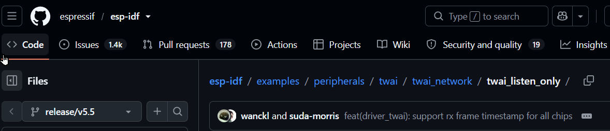
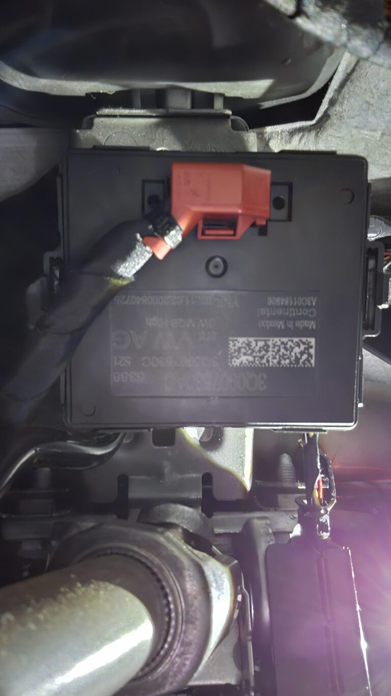
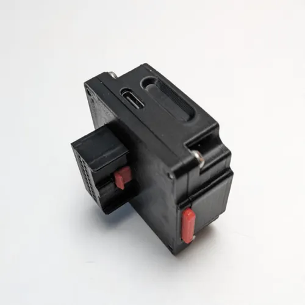

# CAN_Sniffer_ESP32_SLCAN
CAN listening with ESP32-P4 TWAI interface build around example from ESP-IDF v5.5
adapted from ESP-IDF examples:

It is not specific to the ESP32-P4, it is just the board I have.  

It has 3 TWAI interfaces ( i.e. CAN controllers). You will need to wire up a CAN tranceiver to the GPIO 

Also for my use case it is to retrieve CAN signal from a VW vehicle so the raw CAN is not directly accessible at the OBD port but at the CAN gateway J533

you can tee into it with [a dedicated harness](https://www.aliexpress.com/item/1005002726179192.html)   
or you can buy adapter from [Konik"harness"](https://konik.ai/shop/j533-harness-for-mqb) which provides a usb-c connector interface. Beware this is not a usb-c port as you know it merely a connector through which the signals from the gateway are routed including vehicle 12V so do not plug this to a phone or anything else but to a breakout out board in order to retrieve the signals you are interested in.  
 
The can buses are routed to rx/tx pins of the USB-C port. This was the solution from Comma.ai.
you the need a usb-c gen 2 cable and a usbc breakout board [for example](https://www.ebay.co.uk/itm/234690681084):  

GPIO 4 TX and GPIO 4 are the native pins for ESP32p4 for twai interface but this can be reconfigured.

SavvyCAN allows to look at the raw data an reverse engineer the can data if a dbc file is not available but you might find yours in opendbc.

To make use of SavvyCAN the program writes to serial usb the ASCII messsage format expected.

https://github.com/user-attachments/assets/de3f9e23-d387-488e-9aa7-300923362d6c

you can the open a connection to the ESP32 in SavvyCAN

I used ESP-IDF extension in VSCode to configure, build, and flash.

